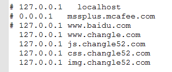

##深入简出的nginx

- [hosts的简单介绍](#hosts介绍)

- [nginx的简单介绍](#nginx介绍)


#####hosts介绍
谈到nginx我们不得不说hosts

hosts的存放在==C:\Windows\System32\drivers\etc==中的一个文件 做前端工作的一般都知道如果想在本地起一个服务我们必须在当前文件夹在打开黑窗口输入	==anywhere==	这条命令 但显示出来的是==http://192.152.0.39:8000/== 这样的地址 其实我们想要的就是在本地直接输入我们的域名就能访问本地的==html==岂不是更好省的每次都要起一个==anywhere==这样多累啊！

这是我的hosts文件里配置 ==127.0.0.1==指的是本机地址


我在地址拦里敲我的域名  直接就出来效果了 是不是很帅啊！但实现以下效果我们就得说说nginx了


#####nginx介绍

 nginx：是一个高性能的 HTTP 和 反向代理 服务器

######下载
 这是nginx的官网http://nginx.org/ 我们应该下载这个版本 ==nginx-1.10.3== 他最新版版本是==nginx-1.11.10==但不是太稳定的毕竟他是测试版！
下载完nginx我们是可以直接用的


######配置
在==conf==这个文件下有一个==nginx.conf==的文件我们需要配置一下
1. 打开后可以看到它的代码大部分是注释掉的 是为了方便我们以后配置
2. 在配置文件里有一段这样的代码 它就是我们要配置的文件(我已经配置好了)
```
server {
        listen       80;#这个是默认的端口号
        server_name  www.changle.com;//这是我们要输入的网站域名

        location / {
            root   E:\qianduan\www\www.changle.com;#这是你网站在本地的地址
            index  index.html index.htm;#它默认是index.html
        }
    }
```
3. html已经配置好了 我们同样也得配置css和js imags 也要在hosts里配置自己的js css imags等域名
4. 同时我们也要配置我们的nginx 文件 和配置html一样
```
server {
       listen       80;
       server_name  css.changle52.com;

        location / {
            root   E:\qianduan\www\css.changle52.com;
        }
    }
	server {
       listen       80;
       server_name  js.changle52.com;

        location / {
            root   E:\qianduan\www\js.changle52.com;
        }
    }
```
######执行
首先先了解一下nginx的常用命令
>- 启动服务 start nginx
>- 停止服务 nginx -s stop
>- 重启     nginx -s reload

如果以上的步骤都执行了 那就开始我们的神奇之旅吧！
1. 需要我们在nginx的文件夹下打开命令窗口 先启动服务 start nginx

2. 这样我们就启动了nginx服务器了 我们就能实现我们刚才在网站地址上的效果了

3. 如果我们更改了==nginx.conf==这个文件  我们需要重启服务==nginx -s reload==

######问题
在我们用nginx的时候会遇到最大的问题是缓存 缓存对于用户来说是非常好的  但是对于程序员来说是非常苦B的事情所有我们要清除缓存 
1. 我们可以停止服务器 在启动服务器这样就不会有命令拦里的窗口缓存的问题了(这里停止服务器是在任务管理器上也必须没有nginx的痕迹)
2. 浏览器的缓存 我们用nginx的时候需要把浏览器的历史记录全部删除 
3. 在页面上我们请求css  js  文件的时候可以在连接后面加上？xxxxx   x必须每次不同
```javascript
<script src="http://js.changle52.com/index.js?1" charset="utf-8"></script>
```
每次不断的该？后面的值 这样就能避免浏览器的缓存问题了

**这就是我们深入简出的nginx**